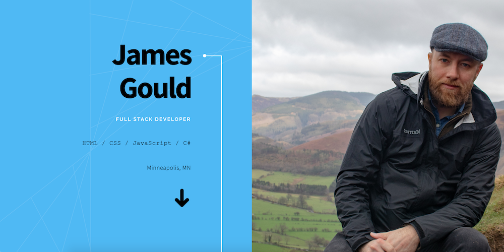

# My Development Portfolio

## Description

This site was built using an [HTML5 Up](https://html5up.net/) template as a starting point, then using Handlebars to dynamically generate content. It contains some information about me personally, a portfolio of my work thus far, and a contact form to get ahold of me.

You can find it _[here](https://nobleburgundy.github.io/portfolio/)_.
